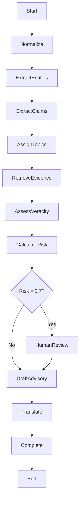

# Phase 16: LangGraph Orchestration - Complete!

## Components Implemented

### 1. Workflow State (`workflows/state.py`)
- TypedDict definition for workflow state
- Tracks all intermediate results
- Includes human review fields
- Error tracking and retry counts

### 2. State Manager (`workflows/state_manager.py`)
- Redis-based state persistence
- Save/load workflow state
- Checkpoint creation and restoration
- State serialization handling

### 3. Verification Workflow (`workflows/verification_workflow.py`)
LangGraph workflow with 11 nodes:
- **normalize** - Normalize raw items
- **extract_entities** - Entity extraction
- **extract_claims** - Claim extraction
- **assign_topics** - Topic assignment
- **retrieve_evidence** - Evidence retrieval
- **assess_veracity** - NLI-based veracity
- **calculate_risk** - Risk scoring
- **human_review** - Pause for manual review
- **draft_advisory** - Advisory drafting
- **translate_advisory** - Multi-language translation
- **complete** - Finalize workflow

**Features:**
- Conditional routing (high risk → human review)
- Sequential execution with state passing
- Error handling at each node
- Auto-save state at checkpoints

### 4. Workflow Executor (`workflows/executor.py`)
- Start new workflows
- Resume paused workflows
- Get workflow status
- Cancel workflows
- Async execution management

### 5. Error Handler (`workflows/error_handler.py`)
- Retry decorator with exponential backoff (tenacity)
- Error handling utilities
- Retry count tracking
- Automatic failure detection

### 6. Parallel Executor (`workflows/parallel_executor.py`)
- Process multiple claims concurrently
- Merge results from parallel branches
- Asyncio-based concurrency
- Result aggregation

### 7. Workflows API (`apps/api/routers/workflows.py`)
Endpoints:
- `POST /workflows/start` - Start verification workflow
- `GET /workflows/{id}/status` - Get workflow status
- `POST /workflows/{id}/resume` - Resume after human review
- `POST /workflows/{id}/cancel` - Cancel workflow
- `GET /workflows/pending-review` - List pending reviews

## Workflow Flow



## Human-in-the-Loop

High-risk items (risk_score > 0.7) trigger human review:
1. Workflow pauses at `human_review` node
2. State saved with status='paused'
3. Notification sent (extensible)
4. Analyst reviews via `/workflows/{id}/status`
5. Analyst approves/rejects via `/workflows/{id}/resume`
6. Workflow continues to advisory drafting

## State Persistence

All workflow state stored in Redis:
- Key: `workflow:state:{workflow_id}`
- TTL: 7 days
- Serialized as JSON
- Automatic datetime conversion

Checkpoints:
- Key: `workflow:checkpoint:{workflow_id}:{name}`
- Restore to previous states
- Useful for debugging and rollbacks

## Error Handling

**Retry Strategy:**
- Max 3 attempts per node
- Exponential backoff (1s to 10s)
- Retry on `RetryableError`
- Log warnings before retry

**Failure Modes:**
- Errors tracked in `state['errors']`
- Retry count incremented
- After 3 retries: status='failed'
-Workflow can be inspected or cancelled

## Usage Examples

### Start a workflow
```python
from workflows.executor import workflow_executor

raw_item = {
    'id': 'item_123',
    'source': 'twitter',
    'title': 'Breaking news',
    'text': 'Some crisis event...',
    # ... other fields
}

workflow_id = await workflow_executor.start_workflow(raw_item)
```

### Check status
```python
status = await workflow_executor.get_workflow_status(workflow_id)
print(f"Status: {status['status']}")
print(f"Risk: {status['risk_score']}")
```

### Resume after human review
```python
await workflow_executor.resume_workflow(
    workflow_id=workflow_id,
    human_decision='approved'
)
```

### Via API
```bash
# Start workflow
curl -X POST http://localhost:8000/workflows/start \
  -H "Authorization: Bearer $TOKEN" \
  -H "Content-Type: application/json" \
  -d '{"raw_item": {...}}'

# Check status
curl http://localhost:8000/workflows/{id}/status \
  -H "Authorization: Bearer $TOKEN"

# Resume
curl -X POST http://localhost:8000/workflows/{id}/resume \
  -H "Authorization: Bearer $TOKEN" \
  -d '{"human_decision": "approved"}'
```

## Configuration

No additional configuration needed. Uses existing:
- Redis (for state)
- FastAPI (for API)
- All agents from previous phases

## Testing

Integration tests in `tests/integration/test_workflows.py`:
- Workflow creation
- State persistence
- Checkpoint restore
- End-to-end execution

Run tests:
```bash
pytest tests/integration/test_workflows.py -v
```

## Next Steps (Phase 17)

Implement advanced media processing:
- Real keyframe extraction (ffmpeg)
- Reverse image search
- EXIF metadata analysis
- Deepfake detection
- Video timeline reconstruction
